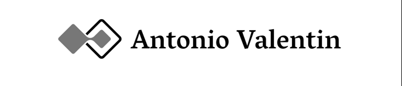

<!-- HEADER -->
<br />
<p align="center">
 <a href="https://github.com/AntonioValentinSayago/.net6_angular_crud">
    
 </a>

  <h3 align="center">App the Movie DB / aync-await</h3>

  <p align="center">
    Javascript Api the Movie DB / aync-await
    <br />
  </p>
</p>

<!-- TABLE OF CONTENTS -->
<details open="open">
  <summary>Table of Contents</summary>
  <ol>
    <li>
      <a href="#about-the-project">About The Project</a>
      <ul>
        <li><a href="#built-with">Built With</a></li>
      </ul>
    </li>
    <li>
      <a href="#getting-started">Getting Started</a>
      <ul>
        <li><a href="#prerequisites">Prerequisites</a></li>
        <li><a href="#installation">Installation</a></li>
      </ul>
    </li>
    <li><a href="#screenshots">Screenshots</a></li>
    <li><a href="#roadmap">Roadmap</a></li>
    <li><a href="#contributing">Contributing</a></li>
    <li><a href="#license">License</a></li>
    <li><a href="#contact">Contact</a></li>
  </ol>
</details>


<!-- ABOUT THE PROJECT -->
## About The Project

[![Product Name Screen Shot][screenshot]](https://github.com/AntonioValentinSayago/.net6_angular_crud)

It is a chat inspired by Whatsapp, developed in Node.js & mysql.

The software is based on private chats between users registered on the platform, it also allows sending messages to emails provided by users.

Tahduth has a multi-threaded system, avoiding server saturation, it has image and emoji processing, it also has a video call system.

Tahduth is still in development, adding new features and fixing bugs. The possibilities with this base are endless, so I hope you can take the source code of this project as an example.

### Built With

This project uses some external libraries, I list them below:
* [socket.io](https://socket.io/)
* [nodemailer](https://nodemailer.com/about/)
* [express-fileupload](https://www.npmjs.com/package/express-fileupload)
* [expressjs](http://expressjs.com/)
* [ejs](https://www.npmjs.com/package/ejs)
* [node-emoji](https://www.npmjs.com/package/node-emoji)
* [mysql](https://www.npmjs.com/package/mysql)
* [body-parser](https://www.npmjs.com/package/body-parser)
* [nodemon](https://www.npmjs.com/package/nodemon)


<!-- GETTING STARTED -->
## Getting Started

Follow the instructions below to get it working and proceed to modify or test this project.

### Prerequisites

You will have to download.
* node.js
* mysql


### Installation

1. Clone the repo
   ```sh
   git clone https://github.com/AntonioValentinSayago/api-movies-asyn-await
   ```
2. Move in console to .net6_angular_crud folder.

3. Install dependencies.
   ```sh
   npm install
   ```

4. Import 'tahduth.sql' to mysql.

5. Run Tahduth.
   ```sh
   npm run build
   ```

6. Open Tahduth-Chat in Chrome, Firefox or Opera.
   ```sh
   http://localhost/8000
   ```


## Screenshots
![Product Name Screen Shot][screenshot01]


<!-- ROADMAP -->
## Roadmap

See the [open issues](https://github.com/AntonioValentinSayago/api-movies-asyn-await) for a list of proposed features (and known issues).


<!-- CONTRIBUTING -->
## Contributing

Contributions are what make the open source community such an amazing place to learn, inspire, and create. Any contributions you make are **greatly appreciated**.

1. Fork the Project
2. Create your Feature Branch (`git checkout -b feature/AmazingFeature`)
3. Commit your Changes (`git commit -m 'Add some AmazingFeature'`)
4. Push to the Branch (`git push origin feature/AmazingFeature`)
5. Open a Pull Request


<!-- LICENSE -->
## License

Distributed under the MIT License. See `LICENSE` for more information.


<!-- CONTACT -->
## Contact

AntonioValentin - cesar_anto30@hotmail.com

Project Link: [https://github.com/AntonioValentinSayago/api-movies-asyn-await](https://github.com/AntonioValentinSayago/api-movies-asyn-await)


<!-- MARKDOWN LINKS & IMAGES -->
[screenshot]: img/demo.png
[screenshot01]: img/antonioValentin.png